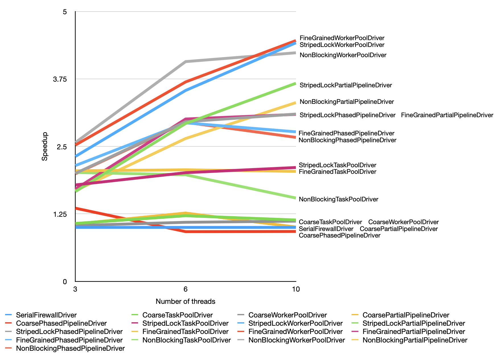
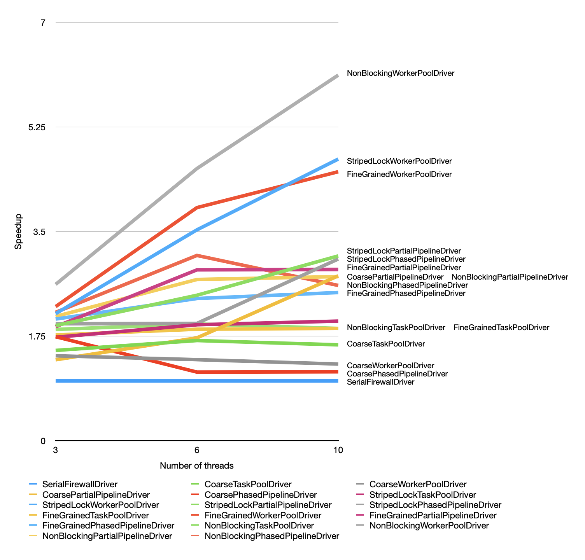

**Abstract**

This report implements efficient packet filtering systems by exploring 
two design dimensions: firewall design and work orchestration strategies. The
report analyzes 4 firewall design directions, including blocking and 
non-blocking solutions. It also studies 4 ways to orchestrate worker
threads. Enumerating the explored design space, this report implements 17 packet 
filtering systems. While firewall efficiency is workload dependent, this report 
finds that a simple, general-purposed worker model, combined with efficient 
firewall implementations, tend to scale best across all workloads.

\pagebreak

# Introduction

This Capstone report details my final firewall design and implementation.
Instead of proposing and implementing one high-performance design, this report
explores multiple implementations by proposing different designs for firewall
designs and architectures for organizing worker threads.

Below, Section 2 examines the design space explored in this work and 
hypothesizes about performance characteristics. Section 3 discusses the 17 
packet filtering system variants implemented. Section 4 shows each firewall 
variant's correctness and progress conditions. Section 5 lists benchmark results 
and analyzes whether results align with initial hypotheses. Section 6 discusses 
future work directions.

## Project specification overview

There are two types of packets: data packets and config packets. A firewall
performs filtering on data packets. Config packets update the rules with which
a firewall performs filtering.

A firewall is logically represented as two abstract data structures: $PNG$ and 
$R$. Both data structures are queryable by addresses. A data packet from source 
address $S$ to destination address $D$ if 
$PNG[S] = \text{False} \land S \in R[D]$.

## Project requirement overview

The main requirement is to process packets atomically. This means config packets
must be processed as if they were serially, and permission changes made by a 
config packet must take effect on subsequent data packets.

# High-performance system design

## Design space

The packet filtering system has two main design dimensions: firewall and work orchestration. 

Firewall refers to the access control lookup data structure for packets. Provided a data packet, a firewall can decide whether it passes access control. With a config packet, a firewall updates its permissions to ban / un-ban certain data packets.

Work orchestration refers to the way packets get to the firewall. In a single-threaded packet filtering system, the firewall processes one packet after another. In multithreaded programs, work can be distributed in different ways. Some workers may specialize in data packets, while others config packets. Work may be statically divided among all threads, or they may be dynamically allocated whenever a worker becomes free. Different strategies yield different performance characteristics.

The main insight of this report is that firewall and work orchestration can be designed  separately. Firewall and work orchestration are not orthogonal: a firewall implementation can optimize for a certain worker architecture, and vice versa. However, having multiple firewall designs and work orchestration mechanisms gives us the ability to mix-and-match them exhaustively. The result is a much more comprehensive exploration of the trade-off between design decisions and workload characteristics.

## Firewall designs

The project investigates the following firewall designs:

1. A firewall with coarse-grained locking
2. A firewall with striped locking
3. A fireall with fine-grained locking
4. A non-blocking firewall

The terminology of "coarse-grained" and "fine-grained" locking is adapted from
Chapter 9 of The Art of Multiprocessor Programming by Herlihy, Shavit, et. al.

### Coarse-grained locking

The coarse-grained firewall uses one reader-writer lock to protect the entire
firewall.

Any update to the firewall permission table requires acquiring the write lock.
Checking a packet's permission requires obtaining a read lock. Subsequent
blocking firewall designs follow the same locking mechanism, even though they
organize locks differently.

This firewall implements $PNG$ and $R$ as two concurrent hash tables.
$PNG$ is a hash table whose keys are integers (addresses) and values are booleans.
$R$ is a hash table whose keys are integers (addressses) and values are a
concurrent skip list set-like structure.

Because there is only one read-write lock, a permission table update would 
cause all concurrent reads and writes to block. Because of this sequential
bottleneck, this design has the least amount of parallelism among all considered
designs. It serves as a baseline for multi-threaded firewall performance.

### Striped locking

The stripe-locked firewall uses a statically allocated lock array to provide
writer-reader mutual exclusion. This is the main difference to its 
coarse-grained counterpart.

With lock striping, this firewall provides disjoint parallel access for reads
and writes that access different locks, thereby providing more parallelism than
the coarse-grained version. However, if reads and write contend over a specific 
lock, a write blocks all read operations that depend on the same lock. This is
sometimes referred to as a "stop-the-world" scenario.

We hypothesize "stop-the-world" scenarios would become more common as more 
config packets are processed. Because the size of $PNG$ and $R$ grows while the 
striped lock array is static, more addresses are forced to share the same lock.

### Fine-grained locking

Compared to striped locking, this design increases the number of locks as more 
config packets are processed and the set of permission constraints grows.

Conventionally, $PNG$ and $R$ may be implemented as two concurrent hash tables. 
In order to serialize the processing of a configuration packet, the firewall 
must lock one entry in $PNG$ and another in $R$. The entry in $PNG$ sets a new persona-non-grata status for source address $s$, and the one in $R$ ban or 
un-ban some packets routed to destination $d$.

We observe that $s = d$ in every configuration packet. By co-locating
information in $PNG$ and $R$, we can use one hash map instead of two to
represent permission constraints. We call this new hash map $PNGR$.

The fine-grained locking design contains one concurrent hash map -- the $PNGR$ 
-- instead of two. The keys of this hash map are integers (addresses). Each 
value entry, of type `PNGRMapValue`, contains:

- a boolean (the persona non grata value originally stored in $PNG$)
- a concurrent skip list-like structure (the value stored in $R$), and
- a reader-writer lock

When a writer processes a config packet with address $k$, it acquires a single 
lock associated with address $k$. A packet is only blocked if its source or
destination address is $k$; it is serialized after the writer's updates. Unlike with
striped locks, this design does not impose "collateral blocking" for packets
un-related to the address $k$.

This design requires more memory usage than lock striping as $PNGR$ grows. With 
this trade-off, we hypothesize this design would perform better than lock 
striping when:

1. The striped lock array is small relative to the size of $PNG$ and $R$, or
2. The number of packets processed is high, leading to a high number of constraints, or
3. The proportion of config packets is high, or
4. The addresses affected by config updates collide often with data packets

### A non-blocking design

This non-blocking design eliminates the lock stored in each entry of $PNGR$ in 
the fine-grained locking design.

To achieve this, the design leverages Java's `AtomicStampedReference`. Compared 
to the fine-grained locking version, the value type for this $PNGR$ changes from 
`PNGRMapValue` to `AtomicStampedReference<NonBlockingPNGRMapValue>`. 
`NonBlockingPNGRMapValue` is the same as `PNGRMapValue` except it does not have a 
read-write lock. 

Core to this design's correctness is the "stamp" associated with each entry
in the $PNGR$ hash map. Whenever a write to a entry occurs, the stamp is
incremented to reflect a mutation has occurred. The stamps serve as version
numbers for each map entry.

Readers of $PNGR$ need to access two entries: one for a packet's source address
and another for its destination address. To ensure that the accessed entries 
have not been concurrently updated, the reader must check that the two entries' 
stamps have not changed. A reader retries if it observes one or more of the 
stamps have changed.

Compared to the fine-grained locking design, we hypothesize that this design
performs poorer if the proportion of config packets is low. This is because
checking two stamps can be expensive, and this cost is paid on every data 
packet's access control check.

On the other hand, with a higher config packet percentage, one may favor this 
design over fine-grained locking. With reader-writer locks, all readers are 
excluded when a writer is performing update. In contrast, this non-blocking 
design allows readers to access $PNGR$ while a writer is concurrently attempting 
to update. A writer's mutations do not take effect until the writer 
completes `compareAndSet()` successfully. Before this `compareAndSet()` takes 
effect, a number of readers could have read the previous state and returned.

### Performance hypothesis

This report makes the following performance hypotheses:

1. The coarse-grained locking firewall scales poorly, due to its sequential locking bottleneck. Other designs scale much better in comparison.
2. Performance of the stripe locked firewall and the fine-grained firewall converge as the number of locks in the stripe design increases.
3. Throughput of the stripe locked firewall drops over time when compared with the fine-grained firewall.
4. The non-blocking firewall performs better relative to the fine-grained firewall as the percentage of config packets increases.

## Work orchestration strategies

Work orchestration is another design dimension of packet filtering systems.
In this report, we explore the following work orchestration models:

1. The 1-packet-per-task model
2. The n-packets-per-task model
3. The independent worker model
4. The partial pipeline model
5. The phased pipeline model

### The 1-packet-per-task model

This model leverages Java's `ExecutorService`. Internally, the executor service 
maintains a fixed pool of threads, which take work from a concurrent queue. Each 
packet is enqueued as a piece of work -- a task -- for the worker threads to 
process.

Obeying the constraint of no more than 256 packets in flight (Little's Law), 
this model supports up to 256 worker threads.

We hypothesize that this model would scale poorly, because worker threads
contend with one another when dequeueing work. As the number of threads grow,
the amount of contention in dequeueing increases.

Interestingly, contention should decrease if the chosen firewall
performs *poorly*. If packet processing takes long, an idle worker polling work
faces less contention because many other workers are still processing packets. 
This design penalizes a better-performing firewall, because workers are more 
likely to be work-polling, making them more likely to contend with one another.

### The n-packets-per-task model

Like the previous model, this model also uses Java's `ExecutorService`. However,
instead of submitting each packet as a task, this model submits $n$ packets as
one task. 

This design reduces the cost of contention at the work queue. Each worker 
dequeueing work processes $n$ packets (except for the last task due to 
rounding). It does not revisit the work queue until $n$ packets are processed.

However, this design also limits the number of maximum threads in the system.
Because each worker can process $n$ packets independently, the number of workers
is constrained by Little's Law. Specifically, the maximum number of workers
is:

$$\text{max number of workers} = \lfloor 256 / n \rfloor$$

Indeed, the 1-packets-per-task model is but a special case of this model. When
$n=1$, the system can accommodate up to 256 threads.

We hypothesize that this model would scale poorly on processors with many cores. 
With a limited number of cores -- say, 4 -- this design should perform much better
than the previous model. Each worker polls work much less frequently if a unit
of work contains 64 packets. However, the contention reduction effect diminishes
exponentially as the number of threads increases. With 32 threads running on 32
cores, each worker only processes 8 packets before polling from the queue again. 
The more frequent a worker is required to coordinate -- here, in the form of 
dequeueing -- the less scalable the system becomes.

### The independent worker model

The key bottleneck in the two prior models is the single, concurrently accessed
queue. In this design, we alleviate this bottleneck by asking each worker to
poll packets independently.

Because each worker processes one packet at a time, and only polls the next
packet when the previous one completes, the system allows up to 256 threads
without violating Little's Law.

We hypothesize that this design performs much better than the two task models
before. This is attributed to the removal of multi-worker contention during
the packet dispatch phase.

### The partial pipeline model

The previous three models use general-purposed workers: each worker processes
each packet it receives, with no regard to the packet's content.

In this design, we introduce *partial* pipeline where packets first go through
config workers, then through data workers. Config packets are not forwarded from
config workers to data workers. Data packets are ignored among config workers
and are simply forwarded. 

Each data worker contains a multi-producer single-consumer queue, allowing 
config workers to place work on a data worker. Each config worker has reference 
to all the data workers; it forwards data packets to data workers in a 
round-robin fashion.

The performance of this partial pipeline architecture may be highly
firewall-implementation dependent. A firewall design that provides efficiency
gains for repeated writes / reads may work best with this partial pipeline
approach.

### The phased pipeline model

In this design, we partition work differently: instead of dividing work into
data and config packets, we divide work into two phases -- a *control* phase
followed by a *collection* phase.

In the control phase, packets are processed by accessing the firewall. A 
config packet requires updating permission constraints, while a data packet 
requires looks up permissions.

Only data packets that pass access control are forwarded to the collection phase.
In this phase, workers collect a data packet's fingerprint, then discards the
packet.

The goal behind this work partition strategy is to remove fingerprint collection
from the speed-critical, firewall-related path. The cost of fingerprint
collection would not be trivial. The fingerprint collector is implemented as a
shared, concurrent hash map for collector threads to write to. While no
synchronization is required among writers, updating a concurrent hash map on
every permitted data packet remains a significant cost. Off-loading this work to 
other threads can allow control workers to process packets at a higher rate.

However, it is possible that packets build up unbounded in the collection phase,
if the control phase is able to process packets at a faster rate than the 
collection phase. In this case, the system's overall throughput can still be 
limited by fingerprint collection.

We hypothesize that this pipeline's performance is sensitive to 1) the
percentage of data packets that pass access control, and 2) the configuration
of control worker count versus collection worker count. Configuring too many
collection workers may lead to idle threads, while under-configuring may
lead to yet another bottleneck.

# Implementation: enumerating design choices

## Key interfaces

There are two key interfaces in this project: `Firewall` and `FirewallDriver`.
`Firewall` implements the access control lookup functionalities and allows
threads to update the permission table. `FirewallDriver` orchestrates
worker threads to use `Firewall` instances. Firewall implementations implement 
the `Firewall` interface. `FirewallDriver` instances use firewall instances.

### Interface `Firewall`

The `Firewall` interface is as follows:

```
public interface Firewall {
    public boolean decide(Packet dataPkt) throws IllegalArgumentException;
    public void update(Packet configPkt) throws IllegalArgumentException;
}
```

The first method, `decide()`, decides whether a data packet passses access 
control. The second method, `update()`, updates the internal permission table
to reflect permission changes as specified in a config packet. Both methods
throw `IllegalArgumentException` if they are called with an incorrect packet 
type.

### Interface `FirewallDriver`

The `FirewallDriver` interface is as follows:

```
public interface FirewallDriver {
    public void process(int nPackets) 
            throws InterruptedException, ExecutionException;

    public FirewallWarmupWorker warmup();

    public void restart();

    public String getName();
}
```

The key method in this interface is `process()`. It blocks until $N$ packets
have been processed. This is the method that orchestrates workers by
instantiating helper worker pool classes, starting threads, and waiting for
them to join.

Other methods are used by the benchmarking class `FirewallBenchRunner`. 
`warmup()` processes enough configuration packets to let the `Firewall`
internal to a `FirewallDriver` instance reach a stable state. `restart()`
re-initializes the internal `Firewall` instance. `getName()` returns a
readable name to identify a driver's benchmark results. 

## Composing firewalls and work orchestration strategies

A high-level goal of this report is to try many firewall system designs, as
opposed to implementing a single high-performance design. Exploring many
implementations allow us to identify designs that perform best under
different workloads, which is likely to be different.

In Section 2, we identified two main dimensions of design differentiation:
firewall and work orchestration. Below we describe how they are composed 
together.

`FirewallDriver` is the main interface through which the external world
(e.g. benchmarking code) interacts with the packet filtering system. When
referring to firewall systems or packet filtering systems in this report,
they refer to a specific `FirewallDriver` implementation.

All `FirewallDriver`s are required to implement `createFirewall()`, which 
constructs a new `Firewall` instance. This requirement is specified in base
class `AbstractFirewallDriver`.

Multiple abstract firewall drivers class extend `AbstractFirewallDriver` to
specify work orchestration. Work orchestration details are normally implemented
in a worker pool class, typically in `***Pool.java` files. For instance,
`AbstractPartialPipelineDriver` extends the behavior of 
`AbstractFirewallDriver`, further specifying how `PacketPartialPipielinePool`,
a class managing partial pipeline, is constructed, started, and joined.

Next, concrete classes extend abstract classes to enumerate firewall and
worker orchestration combinations. These concrete classes inherit from an
abstract class specifying a worker architecture. The concrete classes further
specify which firewall to use by implementing `createFirewall()`. For example, 
`FineGrainedPhasedPipelineDriver` constructs a new `FineGrainedFirewall` 
instance in its firewall factory method.

Drivers follow the naming convention of `<FirewallDesign><WorkStrategy>Driver`.
For instance, `NonBlockingWorkerPoolDriver` orchestrates general-purposed
workers to use the non-blocking firewall implementation.

Altogether, this report implements 17 driver classes. This consists of 1
serial firewall driver, and drivers using all combinations of the 4 firewall 
designs and 4 work orchestration strategies[^1-pkt-vs-n-pkt] discussed in 
Section 2.

[^1-pkt-vs-n-pkt]: The 1-packet-per-task model is considered a special case of
n-packets-per-task model and is therefore not specially implemented.

# Firewall correctness

In this section, we show that each firewall implementation in this project
is linearizable. We also show each firewall method's progress condition.

All locks used in firewall implementations are Java's `ReentrantReadWriteLock`.
Specifically, they use `ReentrantReadWriteLock`'s standard fairness policy,
which does not preclude starvation[^rwlock_acquisition_order]. Below, we assume
`ReentrantReadWriteLock` to be deadlock-free.

[^rwlock_acquisition_order]: See the default Acquisition order section on
[`ReentrantReadWriteLock`'s documentation](https://docs.oracle.com/javase/8/docs/api/java/util/concurrent/locks/ReentrantReadWriteLock.html).


## Firewall with coarse-grained locking

This firewall is implemented in `CoarseFirewall.java`.

This firewall is linearizable. A `update()` call can be linearized at the point 
of write lock acquisition (or any point during the critical section). A 
`decide()` call that returns `true` is linearized after both `PNG.decide()` and 
`R.decide()` return true. A `decide()` call that returns `false` is linearized 
when it observes either `PNG.decide()` or `R.decide()` returns `false` and 
aborts.

Neither `decide()` nor `update()` can deadlock, for there is only one lock to
obtain. Therefore, both `decide()` and `update()` are deadlock-free.

## Firewall with striped locking

This firewall is implemented in `StripedLockFirewall.java`.

### `StripedLockFirewall` is linearizable

The `update()` method is linearizable. It is linearized when the caller
successfully acquires the writer lock mapped to its config packet's address. 
Readers and writers that depend on this entry are blocked until this writer 
unlocks.

The `decide()` method is linearizable. It is linearized when the method
returns. For invocations that return `true`, the linearization point is after
it observes `R.decide()` returns `true` (before which it has observed 
`PNG.decide()` to return `true`). For invocations that return `false`, it is
linearized when either `PNG.decide()` or `R.decide()` returns `false`, at which 
point the method returns.

### `decide()` is deadlock-free

In `decide()`, a thread locks both the lock mapped to the source address and 
the one mapped to the destination address. A lock cycle cannot form because each 
invocation always locks the lock mapped to the smaller address, whether that is 
the source or the destination address.

It is critical that each lock in the lock array is reentrant. Both source
and destination address can map to the same lock, so a thread may attempt
entering a lock after it has acquired it. Using a non-reentrant lock in this
firewall would break its deadlock-free guarantee.

This method is not starvation-free, because `ReentrantReadWriteLock` is not.

### `update()` is deadlock-free

`update()` does not deadlock because it only acquires one lock.

This method is not starvation-free, because `ReentrantReadWriteLock` is not.

## Firewall with fine-grained locking

This firewall is implemented in `FineGrainedFirewall.java`. This firewall
directly invokes methods defined in `ConcurrentPNGRMap.java`. For this reason,
we focus correctness and progress condition discussion on the latter class.

### `ConcurrentPNGRMap`'s `decide()` is linearizable

First, observe that the `map` in `ConcurrentPNGRMap` never shrinks in number of
entries. Once an entry is inserted, it is never removed.

The `decide()` method gets the two entries corresponding to a packet's source
and destination address, correspondingly. References to the two entries are 
stored as `srcEntry` and `dstEntry`. Each of these entries could be `null` at 
the point of retrieval. The method, handling all possible `null` conditions, is 
structured into four cases.

In the first case, both `srcEntry` and `dstEntry` are `null`. In this case, when 
`srcEntry` is retrieved via `this.map.get(src)`, the destination entry is 
guaranteed to be `null`. Suppose this were not the case, then the destination 
entry is removed in the interval between `srcEntry` is read and `dstEntry` is 
read. But we have established that map entries are never deleted, a 
contradiction. In this execution path, the method linearizes when `srcEntry` is 
read (which is later checked to be `null`), because at this instant both entries 
are `null`.

In the second case, `srcEntry` is `null` but `dstEntry` is not. Because
`srcEntry` and `dstEntry` are not read atomically, it is possible that
a value has been mapped to `src` since `srcEntry` is read. For this reason, we 
check again whether the map contains the key `src`. If this returns `false`, then by 
our observation that `map` only grows, there is a duration during which 
`srcEntry` is `null` and `dstEntry` is not. If `map` does contain `src`, then it 
is not guaranteed that `srcEntry` is `null` when `dstEntry` is read. In the 
latter case, the method retries from the beginning.

Linearization can only occur if the method successfully snapshots 
`srcEntry == null` and `dstEntry != null`, which occurs if 
`this.map.containsKey(src)` returns `false`. If there is a successful
snapshot, the method is linearized when it observes whether the source address 
is permitted from the destination address's perspective. Concretely, it is 
linearized at the linearization point of the `get()` method of 
`ConcurrentDisjointRange` (see Section 4.5).

In the third case, `dstEntry` is `null` but `srcEntry` is not. Like the second
case, it is possible that a value has been mapped to `dst`. The same
snapshotting process occurs to ensure there is a duration during which
`dstEntry == null` and `srcEntry != null`. Once snapshot succeeds, the method is
linearized when source address's persona non grata value is read.

In the fourth case, both `srcEntry` and `dstEntry` are not `null`. The method's
linearization argument is equivalent to that for `StripedLockFirewall`'s 
`decide()` method, because both entries are locked in non-decreasing order. 
The method is linearized when it returns, and the point of return differs 
depending on the state of `srcEntry` and `dstEntry` (neither of which can change 
because writers are excluded due to read lock holder(s)).

### `ConcurrentPNGRMap`'s `update()` is linearizable

The `update()` method is linearized inside class `PNGRMapValue`'s 
`updateConfig()` method. The `updateConfig()` method is linearized when it
successfully acquires the writer lock on this map entry.

### `decide()` is deadlock-free

We consider the four cases that `decide()` handle. In the first case, no locks
are acquired because neither `srcEntry` nor `dstEntry` are defined, and there
is no lock to acquire. In the second and third case, only one entry is defined
and there is only one lock to acquire, hence it's impossible to deadlock.

The deadlock-free argument for the fourth case mirrors that for the `decide()`
method in `StripedLockFirewall`. Locks are always in non-decreasing address
order, precluding the possibility of a deadlock.

Thus the `decide()` method for `ConcurrentPNGRMap` is deadlock-free.

### `update()` is deadlock-free

`update()` does not deadlock because it only acquires one writer lock. This is
acquired in the `updateConfig()` method of class `PNGRValue`.

This method is not starvation-free, because `ReentrantReadWriteLock` is not.

## Non-blocking firewall

This firewall is implemented in `NonBlockingFirewall.java`. Because the firewall 
wraps the internal `NonBlockingPNGRMap` class, the discussion below focuses on 
the internal class.

### `NonBlockingPNGRMap`'s `decide()` is linearizable

Like `ConcurrentPNGRMap`, `NonBlockingPNGRMap`'s internal `ConcurrentHashMap` is
only inserted to and never removed from.

The method first looks up the `AtomicStampedReference`s mapped from a packet's 
source and destination address, stored in `srcRef` and `dstRef` respectively.
Since these references may be `null`, we enumerate the four possible `null`
combinations (mirroring Section 4.3.1).

In the first case, both `srcRef` and `dstRef` are `null`. By the observation
that `map` only grows in size, we know that `dstRef` must be `null` when
`srcRef` is `null` (detailed reasoning listed in Section 4.3.1). The method
is linearized when `srcRef` is acquired via `this.map.get(src)`, at which point
both references are `null`.

In the second case, `srcRef` is `null` but `dstRef` is not. Because `srcRef`
and `dstRef` are not read atomically, a mapping to `src` may have been inserted
in the interim. The method optimistically assumes `srcRef` is still `null` and
only dereferences `dstRef`. After dereferencing, it calculates whether the
packet is permitted, assuming `srcRef` is `null`. The method then validates its
assumption by checking whether `map` contains the key `src`: if yes, then the
method's assumption was incorrect and it abandons the computed `permitted`
value. Otherwise, `srcRef` is indeed `null` when `dstRef` is read. The
method's assumption holds, and the calculated `permitted` value is correct.
In this case, the method's linearization point is the same as the linearization 
point of `hasRecvPermission()`, which has the same linearization point as the 
`get()` method of `ConcurrentDisjointRange` (see Section 4.5).

The third case mirrors the second case. The method only linearizes if the
assumption that no entry is mapped to `dst` is validated. In such an execution
path, the method linearizes when it reads the persona non grata value of the
source address.

In the fourth case, both `srcRef` and `dstRef` are defined. The method enters
a inner while loop; here the method retries until it establishes that neither
the source entry nor the destination entry changed in an interval. The method
first dereferences `srcRef` and `dstRef` to `srcEntry` and `dstEntry`,
respectively, obtaining the stamp for each entry in the process. It then 
optimistically calculates the permission status of this packet, using
information in both entries. Next, the method checks whether the stamps of the 
source and destination entries changed after `srcEntry` and `dstEntry` are first 
read. If either stamp changed, the method retries by repeating the inner while 
loop. Otherwise, neither stamp changed. Then, the method is linearized 
when variable `permitted` is assigned: this occurs either when the thread 
observes `src` is persona non grata, or it ascertains whether `src` can be sent 
to `dst`.

### `NonBlockingPNGRMap`'s `update()` is linearizable

The `update()` method is linearized when its `compareAndSet()` call returns 
`true`. Permission changes from a config packet are made to a cloned map entry,
so these mutations are not observable to other concurrent readers until the
cloned entry is successfully written to the `map` via `compareAndSet()`.

### `NonBlockingPNGRMap`'s `decide()` is obstruction-free

Suppose otherwise. Then a thread is repeatedly executing either the outer 
`while` loop, or the inner `while` loop. A thread that has entered the inner
`while` loop cannot re-iterate the outer `while` loop, since the only way for
a thread to exit the inner `while` loop is to return.

We first consider the case when a thread is stuck in the inner `while` loop.
This thread must consistently observe `snapshotSucceeded == false`, which
implies that one of the entries' stamp has changed. This means the system
overall has made progress, as a `update()` call returned. For the `decide()`
method, if the calling thread executes in isolation -- meaning there is no
concurrent update to the source and destination entries it refers to -- it can
exit in a bounded number of steps.

Next, we consider the case when a thread is stuck in the outer `while` loop. If
so, then the thread must be repeatedly visiting the second or the third case, 
where either `srcRef` or `dstRef` is null. A thread cannot be stuck in the
first case, for it returns immediately; a thread stuck in the fourth case is 
discussed via the inner `while` loop.

If a thread fails to return in the second case, where `srcRef` is `null` but 
`dstRef` is not, it must have observed that a new entry is mapped to the address
`src`. Recall that map entries are never deleted, so the next outer while loop
iteration would bring the thread to the inner `while` loop, already discussed
above.

Similarly, if a thread fails to return in the third case, where `dstRef` is
`null` but `srcRef` is not, it must have observed a new entry mapped to `dst`.
The thread will execute the inner `while` loop, which has already been shown to 
be obstruction-free.

Therefore, this method is obstruction free.

A key takeaway here is that writers could starve readers, if writers repeatedly
mutate a source or destination entry faster than a reader could return. In
practice, this is likely to be a non-issue, for the possibility of writers
winning over readers on *the same* source-destination address pair is
vanishingly small.

### `NonBlockingPNGRMap`'s `update()` is lock-free

Suppose not. Then every thread calling `update()` is stuck inside its `while`
loop. A thread remains in the `while` loop only if the `compareAndSet()` on 
a map entry returns `false`. Because map entries are only being updated through
this method, a thread failing to CAS implies another thread succeeded in CAS.
The thread that successfully swapped a map entry exits the `while` loop,
breaking our initial assumption that no thread makes progress.

## Helper data structure: `ConcurrentDisjointRange`

`ConcurrentDisjointRange` is a disjoint union of address ranges. At a high level, 
a `ConcurrentDisjointRange` partitions the entire integer range into two sets
of integer ranges: one set of ranges map to `true`, while the other maps to 
`false`.

In our use case, the class can be used to manage which source address ranges are 
permitted by a destination address, and which are not.

`ConcurrentDisjointRange` implements the following interface:

```
public interface DisjointRange {
    public void set(int min, int max, boolean update);
    public boolean get(int x);
}
```

The `get()` method checks whether an integer (an address) is in a `true` range
or a `false` range. The `set()` method specifies the $[\text{min}, \text{max}]$
range to be of the `update`'s boolean value.

Internally, it uses Java's `ConcurrentSkipListSet` to manage range 
relationships. `ConcurrentSkipListSet` uses `ConcurrentSkipListMap`,
which is non-blocking[^concurrent_skip_list_map].

[^concurrent_skip_list_map]: `ConcurrentSkipListMap` uses a variant of the HM 
linked ordered set algorithm, according to this class's implementation notes.
The HM linked ordered set has been shown to be non-blocking. See Tim Harris,
[A Pragmatic Implementation of Non-Blocking Linked Lists](https://www.cl.cam.ac.uk/research/srg/netos/papers/2001-caslists.pdf), and
Maged M. Michael, 
[High Performance Dynamic Lock-Free Hash Tables and List-Based Sets](https://docs.rs/crate/crossbeam/0.2.4/source/hash-and-skip.pdf).

The data structure maintains a sorted set of ranges in the variable named 
`constraints`. A `Range` consists of two numbers, one greater or equal to the 
other. An integer within any range in `constraints` has the boolean value of
`!defaultVal`. Conversely, any integer not within any range in `constraints`
has the boolean value `defaultVal`.

Below we show that both `get()` and `set()` are linearizable and non-blocking.

### `get()` is linearizable

The first linearization point is after `floor.max() >= x` evaluates to `true`.
Here, the thread observes that integer `x` is within one of the ranges in
`constraints`, and knows `x` has the boolean value of `!defaultVal`.

The second linearization point is after `ceil != null` evaluates to `false`.
Here, the thread has established that no ranges that are smaller than `x` 
overlap with `x`, and there is no range that is greater than `x`. Therefore, `x`
does not overlap with any range, therefore returning `defaultVal`.

The third linearization point is after `ceil.min() > x`. If this evaluates to
`true`, the smallest range that may overlap with `x` does not overlap with `x`,
and the thread has established that `x` has no overlapping range in 
`constraints`. Otherwise, `ceil`'s minimum boundary must equal to `x`, for
`ceil` cannot otherwise be greater than `x` and overlap with `x`. Here,
the thread returns `!defaultVal` due to the overlap.

Therefore, `get()` is linearizable.

### `set()` is linearizable

`set()` dispatches to one of two internal methods: `addRestriction()` or
`removeRestriction()`. In the first case, the method is linearized when adding a 
constraint to `constraints` takes effect. In the second case, the method
linearizes if it successfully removes the range as proposed by `set()`'s
arguments -- meaning this range was contained in `constraints`
before. Alternatively, the method linearizes if it observes the set of
`constraints` is empty and has nothing to remove. Finally, it linearizes when
the thread observes there is no constraint that overlaps with the one proposed
by `set()`'s arguments.

### `get()` is non-blocking

The `get()` method makes up to two method calls to `ConcurrentSkipListSet`:
a `floor()` call, potentially followed by a `ceiling()` call. These two methods
are non-blocking. Aside from these two method calls, `get()` completes in a 
bounded number of steps. Therefore, `get()` is also non-blocking.

### `set()` is non-blocking

This method invokes either one of two internal methods: `addRestriction()` or
`removeRestriction()`.

The `addRestriction()` method is non-blocking, for it only calls
`ConcurrentSkipListSet`'s `add()` method, which is non-blocking.

In the `removeRestriction()` method, if the `remove()` method call on 
`ConcurrentSkipListSet` returns `true`, then it returns immediately. This
execution path is also non-blocking, for `remove()` is non-blocking.

It remains to be shown that the `while` loop in `remoreRestriction()` is 
non-blocking. Here, the method iterates through `constraints`, the 
`ConcurrentSkipListSet`, in sorted order. For each element that overlaps with 
this method call's argument, it deletes the element and inserts element(s) so 
that there is no overlap. In a scheduling environment where the calling thread 
can execute in isolation, the thread exits the `while` loop as soon as it 
adjusts all overlapping ranges, if there exists any. The `while` loop is 
obstruction-free.

Therefore, the `set()` method is non-blocking.

# Performance evaluation

## Evaluation setup

This report implements 17 firewall systems, combinding different firewalls
and work orchestration strategies. Each firewall system is benchmarked using
each of the 8 packet generating configurations, as specified by project
requirement. Further, each firewall is benchmarked using 3, 6, and 10 worker 
threads. A benchmark measures how fast a firewall system can process 10 million 
packets, when compared to a reference, serial implementation.

The benchmarks are run on a 10-core Apple M1 Pro Silicon. All benchmarked 
figures are the average of 3 trials.

## Speed-up analysis

Figure 1 and 2 in the Appendix contains two plots analyzing speed-up[^full_speedup].

Both figures demonstrate that most firewalls using coarse-grained locking have 
poor speed-up. This is expected, because coarse-grained firewalls have sequential
bottlenecks. Interestingly, `CoarseGrainedPhasedPipelineDriver` achieves a 2.7x
speed-up under preset 8, while most other coarse-grained solutions have speed-ups
under 2. The phased pipeline helps reduce contention on the coarse-grained lock
when using 10 threads, because not all 10 threads are control workers that
access the firewall.

We also observe that n-packets-per-task worker model scale poorly, as was
hypothesized. This is because the task pool architecture limits the number of
concurrent threads to obey constraints imposed by the Little's Law.

Benchmark results reveal that the general-purposed worker model scales the best.
This trend is consistent across different firewall variants implemented in this
report.

The results also show that firewalls using sufficiently many locks 
(fine-grained locking and striped locking) scale well. In particular, there
does not seem to be a significant performance difference between striped locking
and fine-grained locking, suggesting increasing the number of locks has
diminishing returns (discussed further in Section 5.3.1).

Solutions using non-blocking firewalls also scale well. Whether a non-blocking
firewall would perform better than lock-based firewall is workload-dependent,
as hypothesized. However, we initially hypothesized that non-blocking firewall
performs better when config packets percentage is high, while results indicate
the opposite (further discussed in Section 5.3.3).

[^full_speedup]: The submitted source folder contains benchmark data using all
configuration presets. Here, we limit to two presets for discussion.

## Observations

### Increasing the number of locks in striped locking brings diminishing returns

Benchmarking results show striped lock firewall systems increased performance by 
increasing the number of locks. Recall that the striped lock design uses a 
statically allocated read-write lock array. As the number of locks increases, 
it is reasonable to expect better performance, since threads are less likely to 
contend with one another on a single lock.

The table below shows experiment results from altering the number of locks used.
The experiment measured the duration required to process 10 million packets
using 10 threads using parameter preset 1[^striped_lock_exp]. Durations are 
shown in milliseconds:

[^striped_lock_exp]: The data shown here is abridged for readability. Full
experiment included other striped firewall system variants, running 
using different number of threads, and different packet generator 
configurations. These parameters did not meaningfully impact this observation 
and is therefore left out. Full benchmark results available in the submitted 
source folder.

| Duration vs. Num. locks | 1 | 10 | 100 | 1,000 | 10,000 | 100,000 |
| --- | --- | --- | --- | --- | --- | --- |
| `StripedLockTaskPoolDriver` | 6,538 | 4,265 | 3,820 | 3,560 | 3,699 | 3,698 |

Interestingly, performance gains plateaued very quickly as the number of locks
increased. For 10 million packets, increasing the number of locks used did not 
meaningfully impact performance once the number of locks exceeded 1,000 -- a low
number considering the number of packets processed.

In Section 2, it was initially hypothesized that striped lock firewall's
performance would degrade as the number of packets processed increase. To
address this, the proposed solution was to dynamically increase the number of
locks as the number of packets processed increase -- achieved via fine-grained
locking. 

The experimental results shown here offer counter-evidence for the need to 
expand locks dynamically. This is likely because the internal hash maps' size
has an upperbound, because the number of unique addresses is finite. Therefore, 
once the number of locks is sufficiently large, contention over locks becomes 
manageable. Locks are no longer the bottleneck, and performance gains 
should be obtained elsewhere.

### Fine-grained locking performance similar to striped locking

Below is a table of speed-ups when benchmarked using 10 threads processing 10
million packets. Each column is the speed-up obtained using a specific
packet generator configuration preset. A row either refers to a striped lock
or a fine-grained firewall system implementation. Striped Lock uses 10,000 
locks.

| Firewall vs. Presets | PS1 | PS2 | PS3 | PS4 | PS5 | PS6 | PS7 | PS8 |
| --- | --- | --- | --- | --- | --- | --- | --- | --- |
| `StripedLockWorkerPoolDriver` | 4.42 | 4.58 | 3.34 | 3.27 | 3.12 | 3.68 | 3.07 | 4.71 |
| `FineGrainedWorkerPoolDriver` | 4.46 | 5.16 | 3.81 | 3.47 | 3.83 | 3.64 | 3.85 | 4.49 |

Here, we see that the fine-grained firewall performed meaningfully better than 
the striped-lock firewall under presets 2, 3, 5, and 7. Fine-grained locking 
performed worse in preset 8.

The difference between fine-grained and striped locking's performance
is smaller than expected. As the previous section points out, this is probably
due to a diminishing performance return as the number of locks used in striped
locking becomes sufficiently large.

### Non-blocking firewall mostly over-performs fine-grained firewall

Below is a table of speed-ups when benchmarked using 10 threads processing 10
million packets. Each column is the speed-up obtained using a specific
packet generator configuration preset. Row either refers to a fine-grained
or a non-blocking firewall system implementation.

| Firewall vs. Presets | PS1 | PS2 | PS3 | PS4 | PS5 | PS6 | PS7 | PS8 |
| --- | --- | --- | --- | --- | --- | --- | --- | --- |
| `FineGrainedWorkerPoolDriver` | 4.46 | 5.16 | 3.81 | 3.47 | 3.83 | 3.64 | 3.85 | 4.49 |
| `NonBlockingWorkerPoolDriver` | 4.23 | 4.97 | 4.36 | 4.70 | 4.92 | 4.98 | 5.11 | 6.12 |

Here, we see that the non-blocking implementation performs substantially better
than the fine-grained implementaion in presets 3 to 8. Speed-up differences are
the most prominent in presets 7, 8, and 9.

This result contradicts our initial hypothesis that non-blocking implementations
perform better than fine-grained solutions when config packet percentage is
high. In fact, the non-blocking solution was slower in preset 1, where the 
percentage of config packets is 24%, the highest among all workload presets.

In Section 4.4.3, we suggested that writers could starve readers in non-blocking 
firewall if config packet updates are often. The speed-up column for preset 1
offers evidence corroborating this hypothesis. As the permission table updates
more frequent, it may be more efficient for the writer to take out a
lock, perform mutation without interruption, than for readers and writers to
access the data structure concurrently.

### Pipelined workers seem to perform worse than general-purposed workers

Below is a table comparing speed-ups when using general-purposed workers versus
specialized workers. The general-purposed worker model (first data row) uses 10
threads. The partial pipeline uses 5 data workers and 5 config workers. The
phased pipeline uses 8 control workers and 2 collection workers.

| Firewall vs. Presets | PS1 | PS2 | PS3 | PS4 | PS5 | PS6 | PS7 | PS8 |
| --- | --- | --- | --- | --- | --- | --- | --- | --- |
| `NonBlockingWorkerPoolDriver`      | 4.23 | 4.97 | 4.36 | 4.70 | 4.92 | 4.98 | 5.11 | 6.12 |
| `NonBlockingPartialPipelineDriver` | 3.31 | 3.71 | 3.21 | 2.72 | 2.92 | 2.73 | 2.71 | 2.74 |
| `NonBlockingPhasedPipelineDriver`  | 2.67 | 2.82 | 2.37 | 2.26 | 2.78 | 3.05 | 2.05 | 2.60 |

Here, we control the firewall implementation to compare different work 
orchestration models. We see that the general-purposed worker model performs 
substantially better than either pipeline approaches.

While this table controls the used firewall implementation to 
`NonBlockingFirewall`, the same trends exist when using other firewalls.
Results are abridged here for readability.

Partial pipeline may work best for a firewall with caching, which is not
implemented for this report. Recall that partial pipeline refers to an
architecture where workers either only work on data packets or config packets.
With caching enabled, data workers may achieve much better performance because
a good caching implementation provides cache locality for packets on the same
train.

In the phased pipeline approach, the fingerprint collection phase became a
bottleneck. In the phased pipeline, the first phase either updates permissions
for a config packet, or looks up permission for a data packet, while the
second phase collects fingerprints from data packets that pass access control.
Here, the benchmark dedicates a low proportion of workers to the second phase
to avoid high contention on the `ConcurrentHashMap` that underpins fingerprint
collection. Despite contention being lower, having a much smaller pool of
workers in the second phase meant the second phase became the bottleneck.
This was unexpected, because it was assumed that the cost of performing
access control-related tasks was much more expensive than collecting 
fingerprints.

# Future work

This report did not explore firewall designs that exploit caching in depth.
Firewalls with caching may be particularly suitable for the partial worker
pipeline. However, initial experimentation with firewall with caching points
to substantial overhead in cache invalidation. The trade-off between
cache invalidation accuracy (not unnecessarily revoking entries that are not 
stale) and cache retrieval efficiency can be further studied.

Our experiments also point to fingerprint collection as a bottleneck factor
as the number of threads scale up. Future reports could explore fingerprint
collection mechanisms that use less synchronization. Specifically, one could
consider a MapReduce-like architecture, where workers collect fingerprints
locally, and "reducer" threads combine fingerprints collected by workers via
a tree-like reduction scheme.

Lastly, this report primarily considered efficiency from the perspective of
packet processing throughput, without thoroughly investigating each approach's
memory usage implications. Future reports may consider incorporating memory
usage into their analyses.

\pagebreak

# Appendix



